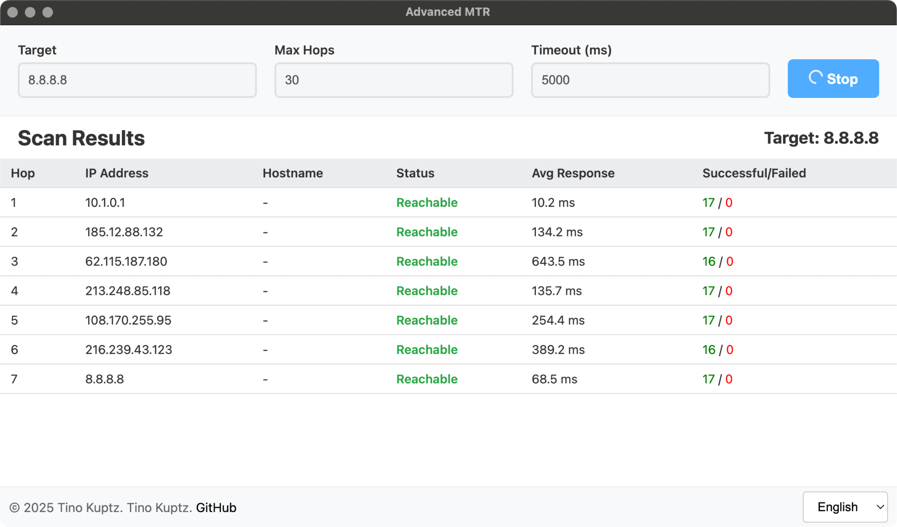
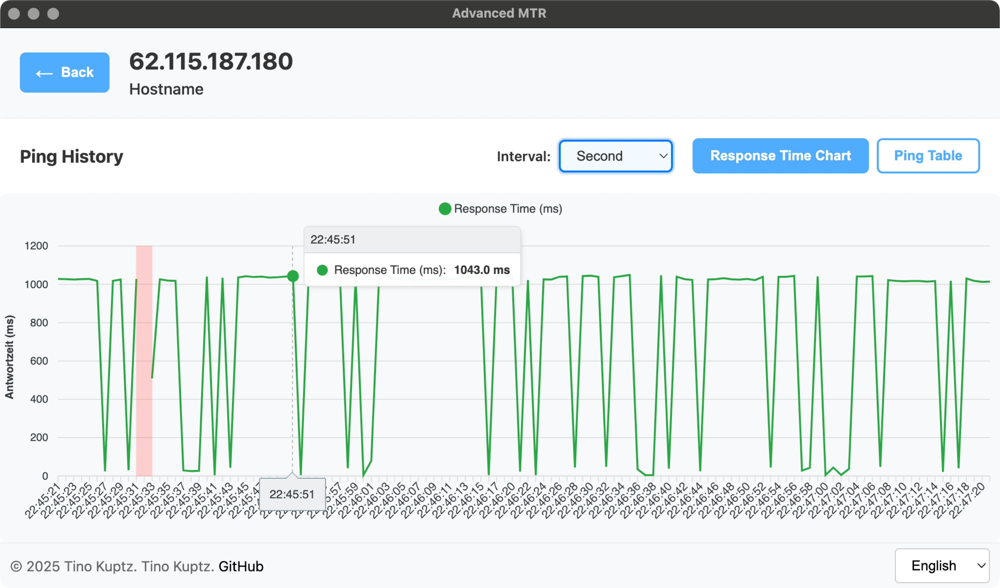

# Advanced MTR

Software to perform an MTR (Matt's traceroute) and ping indivdiual hops separately.<br>Support for analyzing when exactly ping loss or interruptions occurred for individual hops. Results can also be **exported and imported as JSON**, making it easier to share with external parties for analysis 💪

Runs on Windows, macOS and Linux thanks to Electron

</img> </img> 
</img> </img>

## How it works

The tool first determines the route to the target by sending ping packets with incrementally increasing TTL (Time To Live). Depending on the operating system, the native `traceroute` (on Unix systems) or `tracert` (on Windows) is used. Each router along the path responds with a "TTL expired" message, allowing the IP addresses of individual hops to be determined.

After completing the route determination, continuous monitoring begins: each identified hop is pinged every second (using the OS builtin ping tool). All ping results are stored together with a timestamp, enabling later analysis. The output of the ping command is parsed, so we get a way more accurate result; in case it can be parsed, the execution time of the conmand will be taken as response time.

The collected data can then be analyzed over various time periods (seconds, minutes, hours) and exported if needed for external processing.

## Installation
Will probably only work on macOS, but might with luck also work on Linux.

1. **Install dependencies**:
```bash
npm install
```

2. **Start development server**:
```bash
npm run dev
```

3. **Create production build**:
```bash
npm run build
```

## Architecture

### Frontend (Vue.js)
Located in the `/src` directory

### Backend (Electron)
Located in the `/electron` directory

### Scripts
Currently only two relevant ones:
- `npm run dev`: Builds Electron, starts Vite, and then opens Electron on `http://localhost:5173`
- `npm run build`: Builds the entire application for all architectures

Important note about `npm run dev` - the frontend supports hot reloading thanks to Vite, the backend doesn't. It was too much effort for me during development when the alternative for backend changes is simply CTRL+C, up arrow and Enter.

### Pull requests
Are welcome

## Export format

In case you need it for further analysis
```jsonc
{
  "version": "2.0.0",
  "config": {
    "target": "8.8.8.8",  // <-- entered host
    "maxHops": 30,        // <-- entered hop count
    "timeout": 5000,      // <-- entered timeout (ms)
    "probesPerHop": 3     // <-- cant be changed in frontend
  },
  "hops": [
    {
      "hopNumber": 1,    // <-- hop no (1 to x)
      "ip": "10.0.0.1",  // <-- ip of hop
      "hostname": null,  // <-- hostname of hop (or {null} if not able to resolve)
      "pingHistory": [
        {"s": 1755526341547,"e": 1755526341561}, // s = start of ping
        {"s": 1755526342551,"e": 1755526342562}, // e = icmp reply
        {"s": 1755526343556,"e": null}           // if e = null, it's a timedown
      ]
    },
    {
      "hopNumber": 2,
      "ip": "185.12.88.132",
      "hostname": null,
      "pingHistory": [
        {"s": 1755526341549,"e": 1755526341562},
        {"s": 1755526342552,"e": 1755526342563},
        {"s": 1755526343557,"e": null}
      ]
    }
  ],
  "exportDate": "2025-08-18T16:17:25.850Z" // <-- when did the user click on "export"? (iso time)
}
```