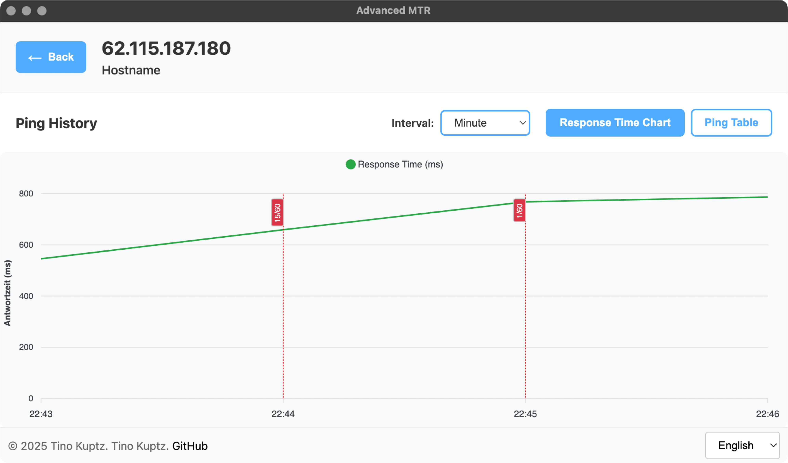

# Advanced MTR

Software, um einen MTR (Matt's traceroute) durchzuführen und die Hops einzeln anzupingen.<br>Unterstützung für eine Auswertung, wann genau es zu Pingverlust oder Abbrüchen für einzelne Hops kam. Ebenfalls können Ergebnisse als JSON **exportiert und wieder importiert** werden, was eine Übermittlung an Externe zwecks Auswertung einfacher macht 💪

Läuft dank Electron (theoretisch) auf Windows, macOS und Linux

</img> </img> 
</img> </img>

## Funktionsweise

Das Tool bestimmt zunächst die Route zum Ziel, indem es Ping-Pakete mit schrittweise erhöhter TTL (Time To Live) verschickt. Dabei wird je nach Betriebssystem das native `traceroute` (unter Unix-Systemen) oder `tracert` (unter Windows) verwendet. Jeder Router entlang des Pfades antwortet mit einer "TTL expired"-Meldung, wodurch die IP-Adressen der einzelnen Hops ermittelt werden können.

Nach Abschluss der Routenbestimmung beginnt das kontinuierliche Monitoring: Jeder identifizierte Hop wird im Sekundentakt angepingt. Sämtliche Ping-Ergebnisse werden dabei zusammen mit einem Zeitstempel gespeichert, sodass eine spätere Analyse möglich ist.

Die gesammelten Daten können anschließend über verschiedene Zeiträume hinweg (Sekunden, Minuten, Stunden) ausgewertet und bei Bedarf exportiert werden, um sie extern weiterzuverarbeiten.

## Installation
Wird vermutlich nur unter MacOS, mit Glück aber auch unter Linux klappen.

1. **Abhängigkeiten installieren**:
```bash
npm install
```

2. **Entwicklungsserver starten**:
```bash
npm run dev
```

3. **Produktions-Build erstellen**:
```bash
npm run build:cross
```

## Architektur

### Frontend (Vue.js)
Findet sich im Verzeichnis `/src`

### Backend (Electron)
Findet sich im Verzeichnis `/electron`

### Scripts
Aktuell nur zwei relevante:
- `npm run dev`: Baut Electron, startet Vite, und öffnet dann Electron auf `http://localhost:5173`
- `npm run build`: Baut die gesamte Anwendung für die aktuelle Architektur
- `npm run build:cross`: Baut die gesamte Anwendung für die alle Architekturen

Wichtiger Hinweis zu `npm run dev` - das Frontend unterstützt dank Vite hot reloading, das Backend nicht. Das war mir zu viel Aufwand in der Entwicklung, wenn die Alternative bei Backend-Änderungen einfach STRG+C, Pfeiltaste nach oben und Enter ist.

### Pull requests
Sind gerne gesehen